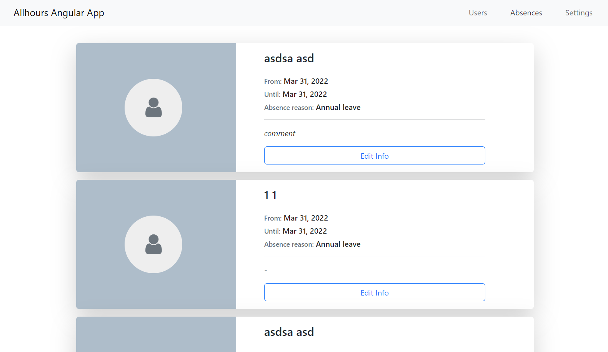

# Allhours REST API Project

The **Allhours REST API Project** is an application designed to interact with the Allhours API for managing employee data, recording absences, and handling absence definitions. The application is built using Angular for the frontend and allows secure access to the API through token-based authentication.

## Key Features

- **User Management**: View and manage users within the system.
- **Absence Management**: Record and manage employee absences along with specific reasons.
- **Secure Authentication**: Authenticate users using a client ID and secret.

## Prerequisites

- [Node.js](https://nodejs.org/) (v14.x or newer)
- [Angular CLI](https://angular.io/cli) (v12.x or newer)
- [Postman](https://www.postman.com/)

### Getting Started

1. **Clone the project**

    ```bash
    git clone https://github.com/yourusername/allhours-app-angular.git
    cd allhours-app-angular

2. **Install Dependencies**

    ```bash
    npm install

3. **Run the Application**

    ```bash
    ng serve

The application will be available at http://localhost:4200/.


## How to Obtain a Token Using Postman

    Follow these steps to obtain an access token using Postman:

1. **Create a New Request**

    Open the Postman application.
    Click the New button, then select Request.

2. **Set Up the Request**

    Name your request (e.g., "Get Token").
    Create a new collection if needed, then click Save.

3. **HTTP Method and URL**

    Select the POST method.
    Enter the URL: https://login.allhours.com/connect/token

4. **Configure Headers**

    Click on the Headers tab.
    Add a new header:
    - Key: Content-Type
    - Value: application/x-www-form-urlencoded

5. **Configure the Request Body**

    Click on the Body tab.
    Select x-www-form-urlencoded.
    - Add three key-value pairs:
    - Key: grant_type, Value: client_credentials
    - Key: client_id, Value: (your client ID)
    - Key: client_secret, Value: (your client secret)

6. **Send the Request**

    Click the Send button.
    In the response, you'll receive an access_token, which you can use in subsequent API calls by including it in the Authorization header in the format: Bearer <access_token>.

## Project Structure

    src/app: Contains Angular components, services, and models.
    src/environments: Environment-specific configurations.
    src/assets: Static files such as images and styles.
    src/index.html: The main HTML file for the application.

## Preview





