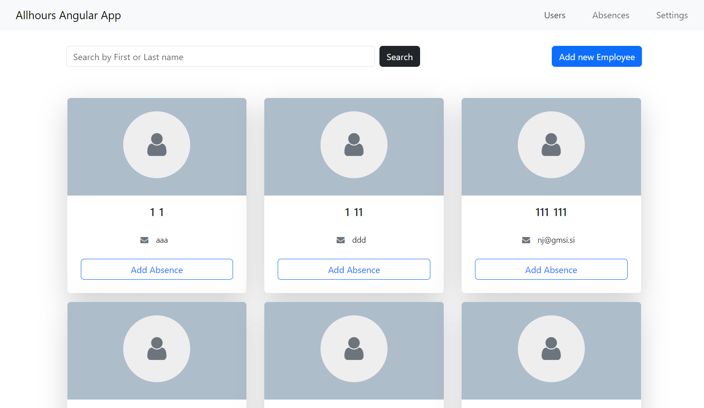

# Allhours REST API Project

The **Allhours REST API Project** is an application designed to interact with the Allhours API for managing employee data, recording absences, and handling absence definitions. The application is built using Angular for the frontend and allows secure access to the API through token-based authentication.

## Key Features

- **User Management**: View and manage users within the system.
- **Absence Management**: Record and manage employee absences along with specific reasons.
- **Secure Authentication**: Authenticate users using a client ID and secret.

## Prerequisites

- [Node.js](https://nodejs.org/) (v14.x or newer)
- [Angular CLI](https://angular.io/cli) (v12.x or newer)
- [Postman](https://www.postman.com/)

### Getting Started

1. **Clone the project**

    ```bash
    git clone https://github.com/kittii9797/allhours-app-angular.git
    cd allhours-app-angular

2. **Install Dependencies**

    ```bash
    npm install

3. **Run the Application**

    ```bash
    ng serve

The application will be available at http://localhost:4200/.


## How to Authenticate Using Client ID and Secret

    To authenticate with the Allhours API, you will need your client_id and client_secret. These credentials will allow you to securely access the API and perform operations such as managing users and absences.

1. **Provide your credentials**

    When prompted, enter your client_id and client_secret in the application.

2. **Access the features**

    Once authenticated, you will be able to access user management and absence management features.


## Project Structure

    src/app: Contains Angular components, services, and models.
    src/environments: Environment-specific configurations.
    src/assets: Static files such as images and styles.
    src/index.html: The main HTML file for the application.

## Preview





